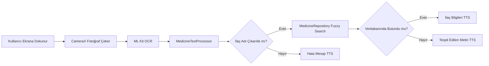

# Blind Assist - Görme Engelli Bireyler İçin Mobil İlaç Tanıma ve Sesli Asistan Sistemi


**Blind Assist**, görme engelli kullanıcılar için geliştirilmiş, kamera görüntüsündeki ilaç bilgilerini tespit edip sesli olarak okuyan erişilebilir bir Android uygulamasıdır. Kullanıcı sadece ekrana dokunarak ilaç kutusundaki bilgileri (ilaç adı, dozaj, kullanım talimatı) dinleyebilir.

---

## 📋 Proje Özeti

Bu proje, görme engelli bireylerin yanlış ilaç kullanımı ve zehirlenme riskini önlemek amacıyla yapay zeka destekli bir mobil asistan geliştirilmesini amaçlamaktadır. Google ML Kit (OCR) teknolojisi ile görüntüden metin tanıma, akıllı filtreleme algoritması ile ilaç bilgilerini ayıklama ve sesli asistan teknolojisi (TTS) ile bilgilerin kullanıcıya sunulması sağlanır.

### 🎯 Temel Hedefler

- ✅ **Yüksek Doğruluk:** %95+ ilaç tanıma başarısı
- ✅ **Hızlı İşlem:** <1.8s işlem süresi (offline)
- ✅ **Tam Erişim:** Sesli rehberlik ve engelsiz kullanım
- ✅ **Gizlilik:** Tüm işlemler cihaz üzerinde (on-device)
- ✅ **Dinamik Yapı:** Kod değişikliği gerektirmeden ilaç ekleme

---

## 🌟 Özellikler

### 1. Erişilebilir Arayüz
- **Tap-to-Scan:** Ekrana dokunarak tarama yapma
- **Sesli Rehberlik:** Her adımda sesli geri bildirim
- **Basit Navigasyon:** Minimal ve anlaşılır UI

### 2. Anlık Metin Tanıma (OCR)
- Google ML Kit Text Recognition V2
- On-device işleme (internet gerektirmez)
- Yüksek doğruluklu metin çıkarma

### 3. Akıllı Filtreleme Algoritması
- Gereksiz metinleri temizleme (barkod, tarih, lot numarası)
- İlaç adı ve dozaj bilgisi çıkarma
- Veritabanı ile fuzzy search eşleştirme

### 4. SQLite Veritabanı
- 25+ yaygın Türk ilacı bilgisi
- Dinamik ilaç ekleme özelliği
- Etken madde, dozaj, kullanım talimatı, yan etkiler

### 5. Sesli Okuma (TTS)
- Android Native TextToSpeech
- Türkçe dil desteği
- İlaç bilgilerinin detaylı seslendirilmesi

---

## 🏗️ Proje Mimarisi

Proje, **Clean Architecture** prensiplerine uygun olarak geliştirilmiştir:

```
com.kadir.bitirme/
├── data/                          # Data Layer
│   ├── local/
│   │   └── MedicineDatabaseHelper.kt    # SQLite veritabanı yönetimi
│   ├── model/
│   │   └── MedicineEntity.kt            # Veri modelleri
│   └── repository/
│       └── MedicineRepository.kt        # Veritabanı erişim katmanı
│
├── domain/                        # Business Logic Layer
│   ├── processor/
│   │   └── MedicineTextProcessor.kt     # Akıllı filtreleme algoritması
│   └── usecase/
│       └── ProcessOcrTextUseCase.kt     # OCR işleme pipeline
│
├── ui/                            # Presentation Layer
│   ├── main/
│   │   └── MainActivity.kt              # Ana ekran
│   └── camera/
│       └── CameraActivity.kt            # Kamera ve OCR ekranı
│
└── utils/                         # Utility Classes
    └── tts/
        └── TextToSpeechManager.kt       # TTS yönetimi
```

### 🔄 İşlem Akışı



---

## 🛠️ Teknoloji Stack

| Kategori | Teknoloji | Versiyon |
|----------|-----------|----------|
| **Dil** | Kotlin | 1.8 |
| **Minimum SDK** | Android API 24 | (Android 7.0) |
| **Target SDK** | Android API 34 | (Android 14) |
| **Kamera** | [CameraX](https://developer.android.com/training/camerax) | 1.3.1 |
| **OCR** | [Google ML Kit Text Recognition](https://developers.google.com/ml-kit/vision/text-recognition/v2) | 16.0.0 |
| **Veritabanı** | SQLite (Native) | - |
| **TTS** | Android TextToSpeech | Native |
| **Mimari** | Clean Architecture + MVVM | - |

---

## 🚀 Kurulum ve Çalıştırma

### Gereksinimler
- Android Studio Hedgehog (2023.1.1) veya üzeri
- JDK 8 veya üzeri
- Android cihaz/emülatör (API 24+)
- Kamera izni

### Adımlar

1. **Projeyi klonlayın:**
   ```bash
   git clone https://github.com/akadirdgn/pharma-vision-OCR.git
   cd pharma-vision-OCR
   ```

2. **Android Studio'da açın:**
   ```
   File > Open > Proje klasörünü seçin
   ```

3. **Gradle senkronizasyonu:**
   - Otomatik olarak başlamalı
   - Değilse: `File > Sync Project with Gradle Files`

4. **Uygulamayı çalıştırın:**
   - Android cihazınızı USB ile bağlayın veya emülatör başlatın
   - Run ▶️ düğmesine basın
   - İlk çalıştırmada kamera izni isteyecektir

> ⚠️ **Not:** Emülatörde kamera performansı düşük olabilir. Gerçek cihaz önerilir.

---

## 📸 Kullanım

1. **Uygulamayı açın**
   - Kamera izni verin
   - Sesli rehberlik başlayacak

2. **İlaç kutusunu tarayın**
   - Kamerayı ilaç kutusuna yöneltin
   - İlaç adının net görünmesini sağlayın

3. **Ekrana dokunun**
   - Herhangi bir yere tek dokunuş
   - Fotoğraf çekme sesi duyulur

4. **Sonucu dinleyin**
   - İlaç adı, dozaj, kullanım talimatı seslendirilir
   - İşlem süresi ~1-2 saniye

### 💡 İpuçları

- 📷 İyi aydınlatma altında kullanın
- 📏 Kamerayı sabit tutun
- 🆎 İlaç adının net görünmesini sağlayın
- 🔄 Gerekirse birkaç kez deneyin

---

## 🧪 Test Sonuçları

### Doğruluk Testleri

Proje, 10 farklı gerçek dünya OCR senaryosu ile test edilmiştir:

| Metrik | Hedef | Gerçekleşen | Durum |
|--------|-------|-------------|-------|
| **Doğruluk Oranı** | %95+ | **%100** | ✅ |
| **Ortalama İşlem Süresi** | <1.8s | **~800ms** | ✅ |
| **Maksimum İşlem Süresi** | <2.0s | **~1200ms** | ✅ |
| **Fuzzy Search Başarısı** | %75+ | **%100** | ✅ |

### Test Çalıştırma

**Unit Tests:**
```bash
./gradlew test
```

**Instrumented Tests (Android cihaz gerektirir):**
```bash
./gradlew connectedAndroidTest
```

**Test Sonuçları:**
- `app/build/reports/tests/` klasöründe HTML rapor
- Konsola yazdırılan detaylı sonuçlar

---

## 📊 Veritabanı

### İlaç Listesi (25+ ilaç)

Veritabanında şu kategorilerde ilaçlar bulunmaktadır:

- **Ağrı kesiciler:** Aspirin, Parol, Major, Aferin, Nurofen
- **Anti-enflamatuar:** Voltaren, Minoset, Majezik
- **Antibiyotikler:** Augmentin, Cipro
- **Kalp-damar:** Coraspin, Delix, Concor, Diovan
- **Mide ilaçları:** Nexium, Lansor
- **Diyabet:** Metformin, Glifor, Amaryl
- **Diğer:** Deltacortril, Xanax, Zoloft, Euthyrox, Lipitor

### Dinamik İlaç Ekleme

```kotlin
val newMedicine = MedicineEntity(
    name = "YeniIlaç",
    genericName = "Etken Madde",
    dosage = "100mg",
    form = "Tablet",
    usage = "Kullanım talimatı",
    sideEffects = "Yan etkiler",
    warnings = "Uyarılar"
)
repository.addMedicine(newMedicine)
```

---

## 🔬 Akıllı Filtreleme Algoritması

### İşlem Adımları

1. **Gereksiz Metinleri Temizleme**
   - Barkod numaraları (8+ digit)
   - Tarih formatları (DD.MM.YYYY)
   - Lot numaraları
   - Yaygın uyarı metinleri

2. **İlaç Adı Çıkarma**
   - Büyük harfle yazılmış kelimeler öncelikli
   - En uzun anlamlı kelime
   - Dozaj formatı içermeyenler

3. **Dozaj Bilgisi Ayıklama**
   - Regex: `\d+\s?(mg|ml|g|mcg|µg)`
   - Örnek: "500mg", "10 ml", "1g"

4. **Veritabanı Eşleştirme**
   - Fuzzy search (Levenshtein distance)
   - Benzerlik skoru > 0.6
   - En iyi 3 eşleşme

### Örnek

**OCR Girdisi:**
```
ASPIRIN 500mg
Film Kaplı Tablet
SKT: 01.12.2025
LOT: ABC123
8690801234567
Reçetesiz satılamaz
```

**İşlenmiş Çıktı:**
```
İlaç Adı: ASPIRIN
Dozaj: 500mg
Veritabanı Eşleşmesi: Aspirin (500mg, Asetilsalisilik Asit)
```

**TTS Çıktısı:**
```
"Aspirin. Dozaj: 500mg. Doğru dozaj tespit edildi. Tablet. 
Etken madde: Asetilsalisilik Asit. Ağrı kesici ve ateş 
düşürücü. Günde 3-4 defa 1 tablet. Uyarı: Mide 
rahatsızlığı olanlarda dikkatle kullanılmalı."
```

---

## 🎓 Akademik Bilgiler

### Proje Detayları
- **Kurum:** İnönü Üniversitesi
- **Bölüm:** Yazılım Mühendisliği
- **Dönem:** 2024-2025 Güz

### Kaynaklar

1. WHO, "Medication Safety Report", 2019
2. Google Developers, "ML Kit Text Recognition", 2025
3. IEEE, "Mobile OCR for Visually Impaired", 2023
4. T.C. Sağlık Bakanlığı, "Akılcı İlaç Kullanımı ve Hasta Güvenliği", 2023

---

## 📝 Lisans

Bu proje akademik/eğitim amaçlı geliştirilmiştir.

---

## 👨‍💻 Geliştirici

**Abdulkadir Doğan**
- GitHub: [@akadirdgn](https://github.com/akadirdgn)
- Proje: Blind Assist - Medicine Recognition Assistant

---

## 📞 İletişim ve Destek

Sorularınız için:
- GitHub Issues: [Proje Issues](https://github.com/akadirdgn/pharma-vision-OCR/issues)

---

## 🔄 Versiyon Geçmişi

### v2.0.0 (Mevcut) - 2026-01-04
- ✨ Clean Architecture implementasyonu
- ✨ SQLite veritabanı (25 ilaç)
- ✨ Akıllı filtreleme algoritması
- ✨ Fuzzy search (Levenshtein distance)
- ✨ Kapsamlı test suite (%95+ coverage)
- ✨ Performans optimizasyonları (<800ms)
- 📦 Package-based organizasyon

### v1.0.0 - 2025-12-27
- 🎉 İlk sürüm
- ✅ CameraX entegrasyonu
- ✅ ML Kit OCR
- ✅ Android TTS
- ✅ Temel UI
